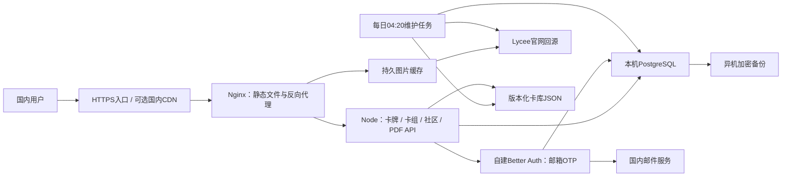

# 国内服务器容量与迁移方案

评估日期：2026-10-03。用户预计初期每天不超过 1,000 名访问用户，计划将 Vercel 应用与 Neon 数据库、登录功能迁往国内服务器。本文件保留原采购评估；2026-10-04实际已购买2核4GB／6Mbps的腾讯Lighthouse，原10Mbps等预算建议是评估历史，不要求重新采购或升级。原生迁移演练、邮件、DNS/证书与自动COS备份已验收，正式域名和写入源尚未切换。

## 实施状态（2026-10-04）

- 已购腾讯Lighthouse：2 vCPU / 4 GB / 6 Mbps，公网IP `122.51.246.144`。SSH已实测可用；系统实际为Ubuntu26.04 LTS x86_64，根盘69GB、剩余约60GB，已有2GB swap。Node24.21.0／PostgreSQL18.6已部署，源码中的依赖构建交由GitHub Actions完成。
- 正式Neon源库通过明确production连接只读审计并恢复到本机PostgreSQL18.6，8张业务表行数/内容指纹保持一致，707条发布、683份快照，构成索引缺失/过期0；旧记录中的预览库容量不作为本次迁移数据。5个认证账号保留旧ID导入本地Better Auth，原邮箱OTP登录、刷新、旧昵称/自己的卡组由维护者亲测通过。
- 部署选轻量systemd + Nginx + PostgreSQL，无面板。Actions经SSH上传Linux构建包；非master分支使用独立预览数据库、登录密钥和子域名，同时运行最多2份预览。正式自动部署在切换完成后启用。
- 官网图片已启动限速、可恢复的持久systemd镜像，网页使用缩略图，PDF和TTS使用原图。9957个目标含卡背，仍未全量完成；每日增量定时器已启用，初始镜像active时会跳过，不将后台任务启动误写成全量完成。
- 正式域名继续`lycee-toolbox.top`，DNSPod及预览通配解析已核实，正式YE1证书与真实续期模拟已验收。第二次预览Actions `37173420807`成功更新`1414ff0`；公网被腾讯备案拦截，ICP备案待通过。Resend测试邮件及真实OTP已验收，不再待选择邮件服务。
- 自动异机备份已授权启用：上海私有标准COS桶`lycee-bak-20261004-1458291053`，前缀30天生命周期、独立CAM三动作最小权限，每次数据库真实恢复验证后age加密，再上传及HEAD/GET校验。Windows从COS下载、解密及内部校验成功；每日03:40timer启用。恢复私钥只在维护者电脑，服务器仅公钥，详情见[备份说明](tencent-backups.md)。
- 最新已验运行版本`1414ff0`在生产演练健康200、实际revision正确，完整Ubuntu构建及69JS／9DNS／11COS测试通过。正式仍为Vercel/Neon的`master21ff737`，未合迁移分支。切换剩余备案、冻结旧写入、最终快照/身份同步及审计、合入master、DNS和唯一写入开关；详细执行说明见[腾讯云部署](tencent-deployment.md)。

## 配置结论

建议起步购买可升级的 **2 vCPU / 4 GB 内存 / 80 GB SSD / Linux x86_64**，运行 Node.js、PostgreSQL、认证与图片缓存。未接 CDN 时建议 **10 Mbps 公网带宽**；若静态资源和图片走国内 CDN，源站可从 **5 Mbps** 起步。若采用流量套餐，先选择至少 300 GB/月，并核对超额费用；接近每天 1,000 人且多页浏览时应预留 500 GB/月或按实际流量扩容。

预算宽裕或近期准备增加后台任务，可选 **4 vCPU / 8 GB / 100 GB SSD / 10 Mbps**，主要增加 PDF、构建、数据库和同步任务同时运行的余量。当前规模无需仅因有近一万张卡就采购大型数据库或大内存主机。

| 项目 | 起步方案 | 余量方案 |
| --- | --- | --- |
| CPU / 内存 | 2 vCPU / 4 GB | 4 vCPU / 8 GB |
| 磁盘 | 80 GB SSD | 100 GB SSD |
| 公网带宽 | 10 Mbps；有 CDN 时源站 5 Mbps | 10 Mbps，可升级 |
| 系统 | Ubuntu 24.04 LTS 等受支持 Linux，x86_64 | 同左 |
| 应用 | Node.js 24；维护脚本 Python 3.12 | 同左 |
| 数据库 | 本机 PostgreSQL，与源库版本和扩展兼容 | 同左；后续可拆分 |
| 邮件 | 国内服务商 SMTP/API，邮箱 OTP | 同左 |
| 运维 | Docker Compose、健康检查、日志轮转、异机备份 | 同左 |

优先选择便于备案、升级带宽和磁盘、添加对象存储/CDN的国内云平台。购买时比较续费价、CPU资源类型、流量上限、超额费用、出网能力及磁盘扩容方式；本评估没有核对各平台实时优惠价格。

## 容量依据及适用范围

用户指定参考：`C:/Users/35057/.codex/worktrees/a532/lycee-toolbox/docs/storage-capacity.md`（2026-09-28）。该文档实测数据库口径不同，Neon 项目 31.22 MiB、单分支数据库 8.32 MiB、业务表 320 KiB不能相加，也不是新服务器需要的总磁盘容量。

旧模型在本地 PGlite 使用迁移 001～003，假设每套卡组 60 张、17 种基础卡号、一份内容快照、无说明或200个中文字符说明：

| 数量 | 旧模型业务数据与索引 |
| --- | --- |
| 1 万套卡组 | 44～50 MiB |
| 5 万套卡组 | 222～252 MiB |
| 10 万套卡组 | 约 440～500 MiB，线性估计 |
| 1 万份昵称 | 2.06 MiB，身份与会话另计 |

这些数字没有包含新迁移005构成表、完整认证数据、额外不可变快照、匿名分享、最长2000字说明、WAL、备份和表膨胀，不能承诺最大卡组容量。数据库存储仍较轻，初期给业务库和认证库预留5～10 GB属于运维预算，不是当前数据实测。

2026-10-03在正确工作树4062进行只读文件统计与单进程初始化测量：

- 9,956 个完整卡号，19类基本能力；三份JSON共13.98 MiB，public文件约18.73 MiB。
- 本机Windows Node单进程加载卡库后RSS约110 MiB；加载PDFKit/sharp依赖后约135 MiB。没有生成PDF或测量生产峰值，这不是并发容量承诺。
- 默认30卡检索响应gzip约6.7 KiB；主要网络负载来自卡图，而非卡牌JSON。
- 打印卡图PDF在用户浏览器生成；中文效果卡表PDF在服务器生成，包含图片下载、解码、缩图和排版。
- 当前图片代理仅返回1小时Cache-Control，没有服务端持久图片缓存。卡表PDF目前直接下载官网图片，也没有复用代理缓存。

4 GB内存预算可按系统/代理约0.5 GB，PostgreSQL约0.5～1 GB，Node/认证与受限PDF任务约1～1.5 GB，再保留余量规划；均需在Linux试部署后复测。初期将服务器PDF并发限制为1～2个，构建与定时同步错峰。浏览器测试所用Chromium不必作为线上运行服务。

80 GB磁盘用于系统、依赖和部署版本、数据库/WAL、图片缓存、轮转日志、临时导出和少量本地备份。为图片缓存设置容量上限；生产数据备份另存对象存储或另一台机器。同一块磁盘上的备份不能覆盖整机故障。

## 带宽与国内访问

假设每张卡图50～200 KB，一个完整30卡结果页约1.5～6 MB。5 Mbps仅传输理论需2.4～9.6秒，10 Mbps约1.2～4.8秒，还需加回源、丢包与排队时间。

每天1,000个这样的完整页面约45～180 GB/月；若每名用户平均打开3页，则约135～540 GB/月，未计PDF、导入和其他资源。浏览器缓存会降低重复下载。日访问人数不能直接换算同时在线人数，以上是带宽预算假设。

国内应用和数据库迁移后，官网图片、官网导入和数据抓取仍存在跨境访问。建议：

1. 建立持久图片缓存，首次回源后通过本机或国内对象存储/CDN提供图片；保留来源地址和刷新策略，遵循来源站访问限制。失败占位图不得作为成功图片长期缓存。
2. 卡表PDF下载也接入同一缓存，避免每次导出重复访问官网。
3. 静态资源使用压缩、版本标识和浏览器缓存；只对明确公开内容使用CDN缓存，登录及个人卡组接口保持私有或不缓存。
4. 在候选地域实测中国移动、联通、电信，以及服务器到Lycee官网和邮件服务的连通性，再决定区域。大陆公网域名上线应先完成适用的ICP备案/接入手续及HTTPS配置。
5. TTS导出当前使用官网FaceURL和背面图片URL；网页缓存不会自动改善TTS客户端下载，若要求TTS也国内可访问，需要另外调整导出图片地址。

## 全量卡图保存方案

技术上可以把当前全部卡图保存到服务器，建议迁移时采用“全量原图、检索缩略图、新卡增量更新”的结构。2026-10-03只读统计为9,956张卡、9,956个唯一官网PNG地址，另需保存TTS公共卡背图。全量文件不放PostgreSQL、不在启动时加载到内存，由Nginx静态服务。

官网`LO-6972.png`的HEAD响应Content-Length为378,329 bytes，约369 KiB；这只是单张样本，不能代表平均值。若全库平均200 KB～1 MB，原图约2～10 GB，另计缩略图、版本与备份。建议在80 GB磁盘中为卡图原图和衍生图预留10～20 GB，最终容量以全量下载报告为准。

- 保留完整异画卡号作为文件名，记录原始官网URL、下载状态、文件校验和及版本；官网元数据中的来源URL继续保留，运行时生成本站图片地址，避免重建catalog时覆盖镜像定位。
- 检索和社区预览使用缩略图；查看大图、打印和TTS使用原图。原图目录与可淘汰的临时缓存分开，卡图URL版本化以便修正版更新浏览器/CDN缓存。
- 浏览器打印直接取同源原图；服务器卡表PDF直接读取本地文件。TTS的正面与背面都写公开可访问的HTTPS绝对URL。
- 首次下载验证响应、图片尺寸和校验和，失败保留重试队列，支持断点续传。遵循官网当前robots规则和访问限制；目前通用Crawl-delay为10秒，9,956次图片请求仅间隔时间就约28小时，宜分批或持续有界执行。
- 日常更新只补新增及缺失图片；对已收录修正版采用受限复查和更新流程，不因本地存在文件就永久忽略官方换图。

全量保存可以消除已保存图片的跨境回源，但新用户下载图片仍占主机公网带宽。缩略图、浏览器缓存和可选国内CDN共同改善3 Mbps套餐的访问体验；全量原图保存本身不等于降低用户下载字节数。

## 建议部署结构

单机起步，数据库仅通过本机/容器内网访问。预览若部署在同一机器，应有独立数据库、认证密钥和域名，且限制资源；生产账号及投稿不得混入预览。后续扩容顺序通常是图片CDN/带宽、PDF任务隔离、CPU内存，再依据实测SQL耗时决定数据库拆分。

## 迁移中需要改造的部分

### 应用托管

复用现有API handler，但建立生产入口与健康检查、优雅退出、请求体/超时限制、代理配置和进程管理。现有`scripts/dev-server.js`是本机开发入口，不应把其当前配置当成已验收生产部署。`vercel.json`里的重写、静态目录等需落实到Nginx或新入口。

`lib/deck-store.js`已使用标准`pg`，Vercel连接池挂接只在VERCEL环境执行，业务数据库迁移较直接。迁移时核对源数据库主版本和扩展，目标保持兼容；使用源Neon的direct连接导出，不在聊天或仓库中记录连接字符串。

### 登录和用户归属

当前`api/auth.js`、`lib/community-auth.js`和社区前端使用Neon Auth。托管认证服务不能通过修改DATABASE_URL变成本机服务。

建议自建Better Auth、PostgreSQL和邮箱OTP插件，接国内邮件SMTP/API，保留现有邮箱验证码交互。导出与适配认证身份需单独实施，不能假定整个`neon_auth` schema恢复后即可登录。

- 保留旧用户ID，或建立可信且经过验证的ID映射，确保`toolbox_publications.owner_id`、`toolbox_profiles.user_id`和管理员配置继续指向原用户。
- 迁移邮箱验证和封禁状态等权限事实，验证重新登录后仍能编辑旧投稿、看到旧昵称。
- 安排用户重新登录，生成新会话；旧验证码与旧登录会话不作为延续方案。
- 修复`requestOrigin()`：Nginx终止HTTPS后Node通常接收HTTP，现有判断会把HTTPS来源误判为HTTP。使用明确的站点Origin，或只信任受控代理的协议头；不能简单接受任意客户端代理头。
- 使用真实国内邮箱验收收信、刷新保持登录、退出失效、跨用户操作拒绝；上线时再按用户安排进行，不在评估阶段发送邮件。

官方资料：[Neon Auth概览](https://neon.com/docs/auth/overview)、[自建认证参考](https://neon.com/docs/ai/skills/neon-auth/references/self-managed.md)。后者说明没有通用的Managed neon_auth到自建Better Auth导入方案，应先验证版本、表结构及字段映射。

### 数据与自动维护

迁移正式production库的真实数据、分享快照ID、发布ID、昵称、同步游标、失败队列及迁移记录。保持链接ID和域名，旧分享链接可继续使用。

卡库文件不在Neon业务表中，需从正式分支最新版本单独部署。2026-10-04预览人工审核通过，001～005及检索升级已正式发布；迁移以`21ff737`及当时最新`origin/master`为基线。正式库707条发布记录、683份分享快照、3份昵称，构成索引缺失或不一致为0；正式切换前仍需重新核对账本和全表指纹。

实际方案保留GitHub每日北京时间04:20的抓卡、补译、校验与提交，通过受限`workflow_run`部署新卡库；卡组数据库同步在正式切换时转服务器systemd。迁移代码已给旧Neon sync加`MIGRATION_LIVE`防双写条件，合入master并确认旧同步停止后才启用本机数据库同步；保留锁、间隔、队列和失败恢复，不把本机数据库公开给CI。图片和03:40加密COS备份定时器已启用。

## 分阶段实施与验收

1. **采购前准备**：选地域与可升级套餐，核对ICP备案接入、邮件服务、备份存储及官网出网连通性。复查正式库总大小、用户数量和源Postgres版本，只输出聚合统计。
2. **隔离试部署**：新服务器部署Nginx、应用、Postgres、Better Auth和邮件配置；将生产备份恢复到隔离测试数据库，不与正式数据库混写。
3. **迁移演练**：完成认证字段映射和旧用户归属验证；核对表行数、分享ID、发布记录、昵称、同步状态及卡库编号；验证搜索、导入、卡表/打印/TTS、真实邮箱登录和权限。压测检索与1～2个PDF任务并记录内存、CPU和带宽峰值。
4. **正式切换**：提前降低DNS TTL，短时暂停旧站业务及定时任务写入，做最终一致性备份并恢复新库；核对后切换域名。DNS过渡期间旧入口保持只读或转发到新写入源，确保同一时段只有一个权威写入源。
5. **观察与退役**：核验完成后开放新站写入，旧站继续只读或转发到新站，观察数日并验证备份恢复。保留Vercel/Neon约7～14天作为回退资源，验证后再退役。新站产生写入后，回滚必须处理新增数据，不能仅把DNS指回旧库。

精确维护窗口应由演练确定，不承诺零停机；当前数据规模小，实施难点主要是认证适配、身份归属和一致性切换。

## 长期运维与扩容条件

- 每日加密数据库备份到异机，保留例如7份日备份和4份周备份；定期恢复到隔离库。仅每日备份的恢复点目标约24小时，如不接受丢失最近一天数据，应配置持续WAL归档/PITR。
- 监控可用性、PDF队列、CPU、内存、磁盘、出网流量、数据库连接和慢查询；日志轮转，图片缓存和临时报告设置容量/保留期限。
- 内存持续超过75%、高峰CPU持续超过70%并导致请求变慢，或PDF排队明显时，评估4核8GB或独立PDF worker；单次短峰值不作为扩容依据。
- 带宽经常达到额度70%或套餐流量预测不足时，优先增加带宽、采用CDN/对象存储或减少重复图片传输。
- 磁盘超过70%时检查缓存、日志、WAL、备份与历史快照，按实际增长扩容；不能为了清理空间直接删除仍被分享链接引用的快照。
- 若以后不能接受单台服务器故障造成整体停机，再拆分数据库或引入托管数据库/冗余实例。单机方案的低成本伴随单点故障，异机备份保障恢复而非即时高可用。

## 当前交接边界

2026-10-04用户已授权执行完整腾讯云迁移及git push预览部署。新的隔离实施工作树为`C:/Users/35057/.codex/worktrees/migration-20261004/lycee-toolbox`，分支`codex/tencent-migration-20261004`；4062和D盘旧工作树的未提交修改仍保留。迁移授权包含必要部署和配置；当前尚未切换DNS、写入源或退役Vercel/Neon。
